Diagramas de Flujo - Sistema CRM
MODULO CLIENTES
1. Crear Cliente
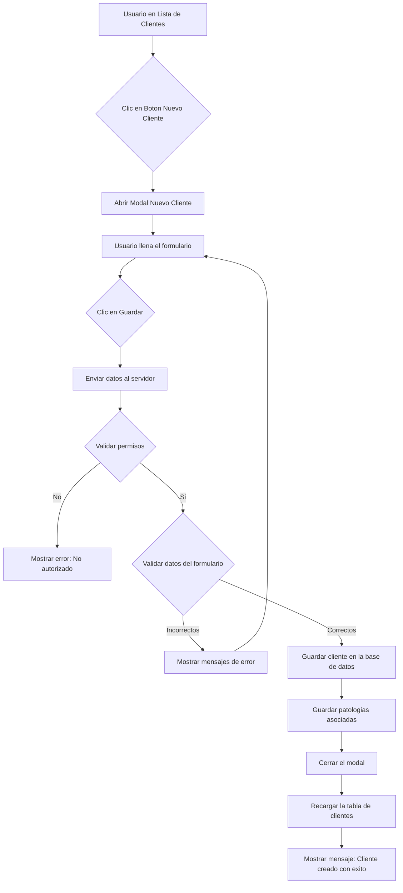

2. Ver Detalle de Cliente
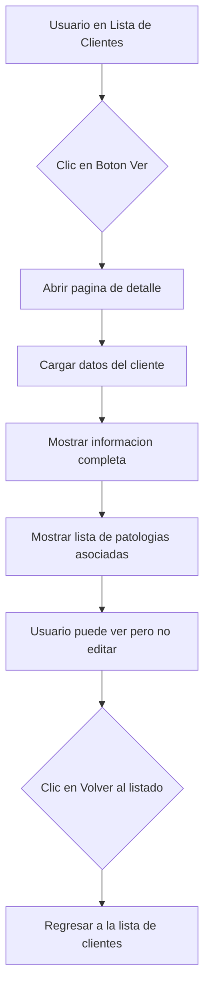

3. Editar Cliente
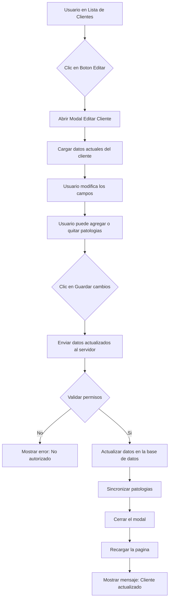

4. Eliminar Cliente
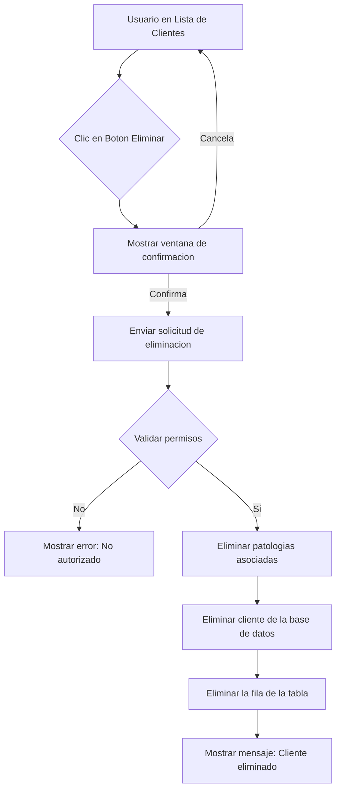

5. Bloquear/Desbloquear Cliente
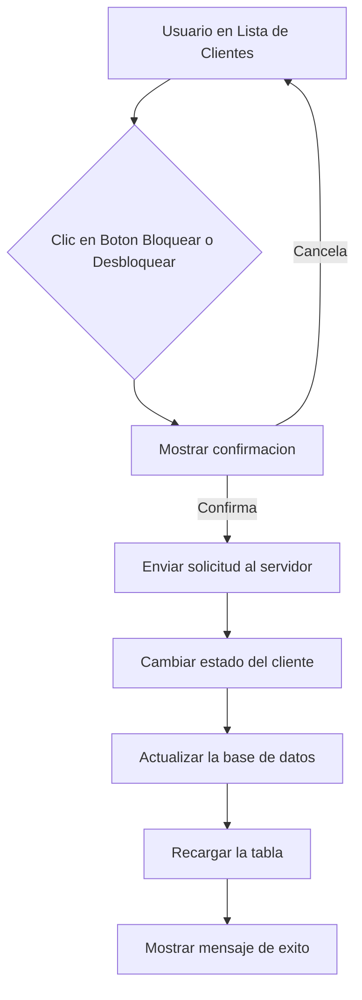

SUBMODULO: ENFERMEDADES (PATOLOGIAS)
Gestionar Patologias
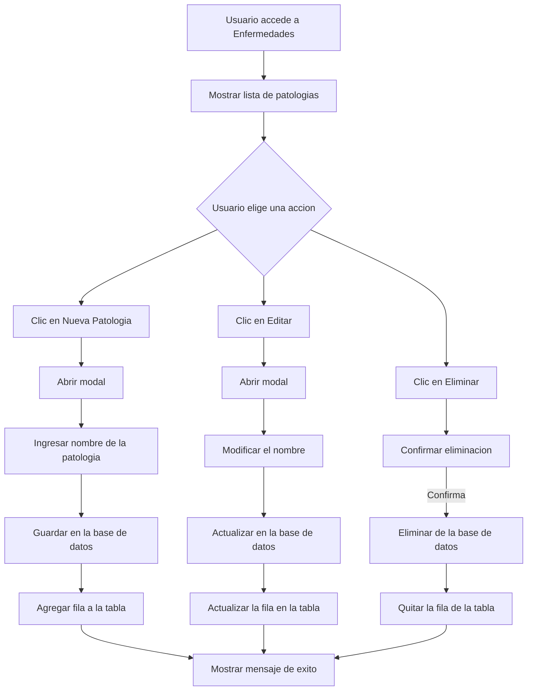

SUBMODULO: INTERESES
Gestionar Intereses
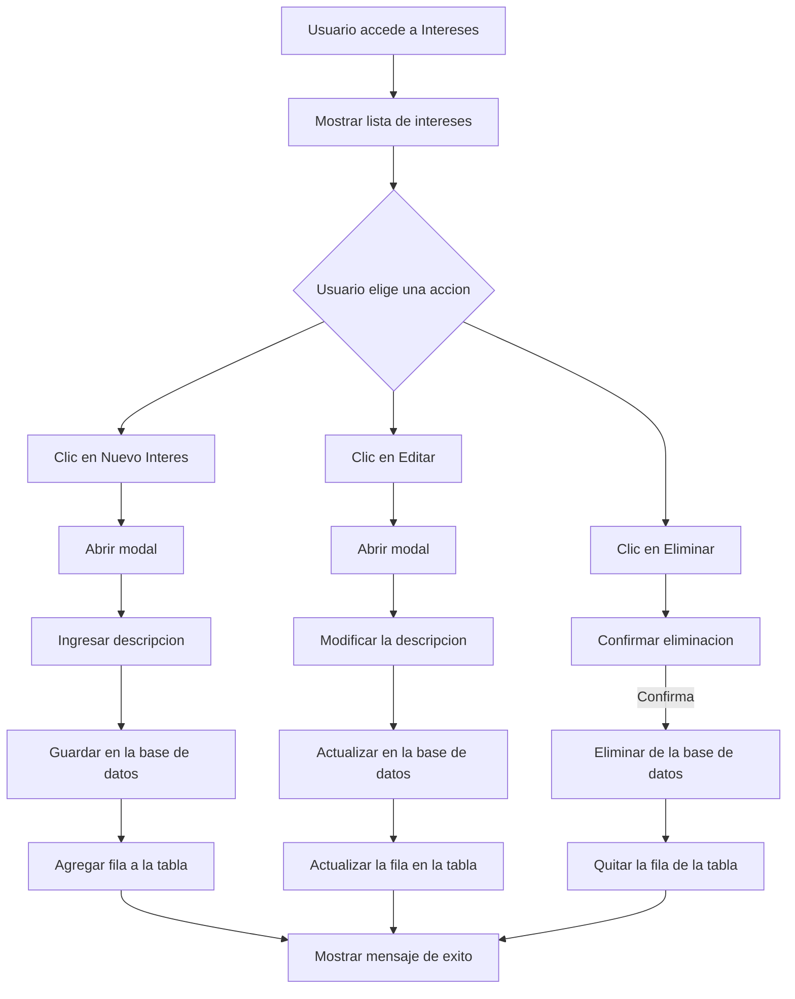

MODULO VENTAS - COTIZACIONES
1. Crear Cotizacion
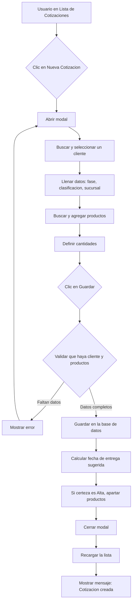

2. Editar Cotizacion y Sistema de Versiones
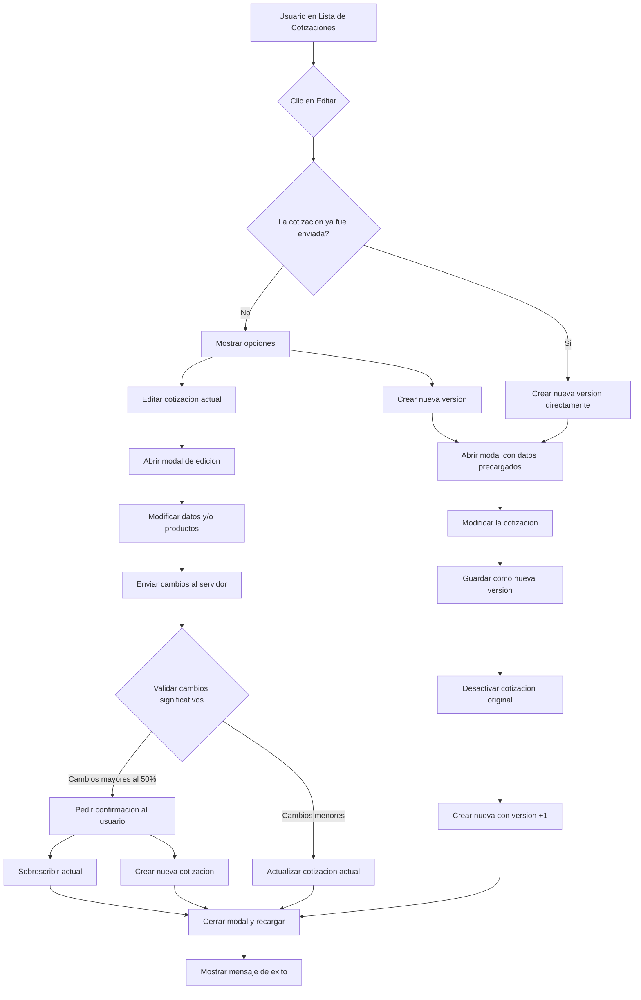

3. Ver Detalle de Cotizacion con Historial
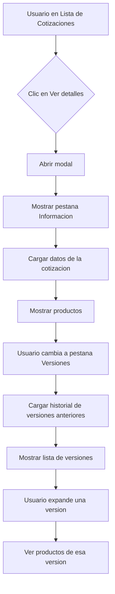

4. Enviar Cotizacion (Generar PDF)
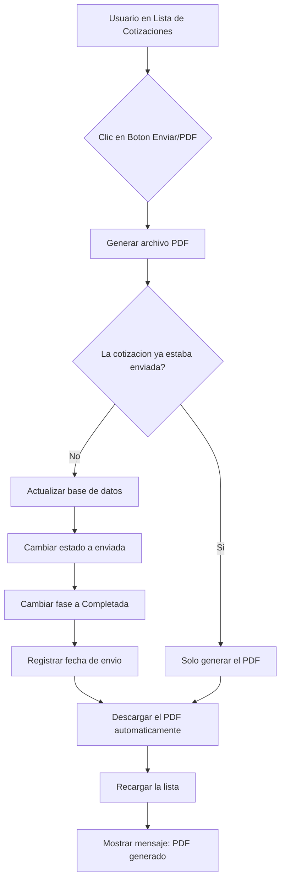

5. Eliminar Cotizacion
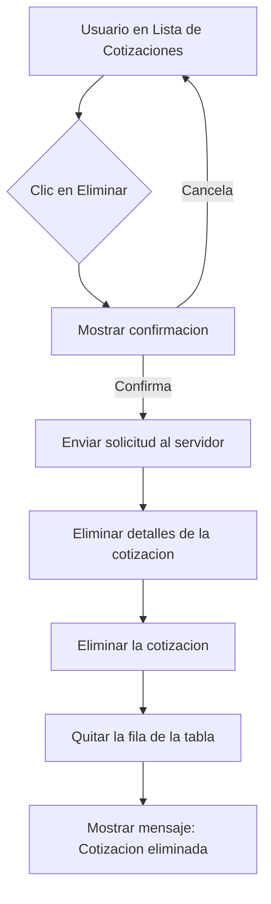

MODULO SEGURIDAD
1. Gestionar Usuarios
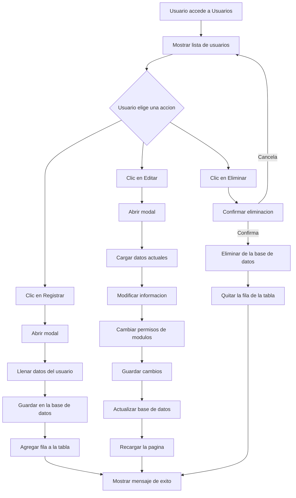

2. Ver Permisos de Usuarios
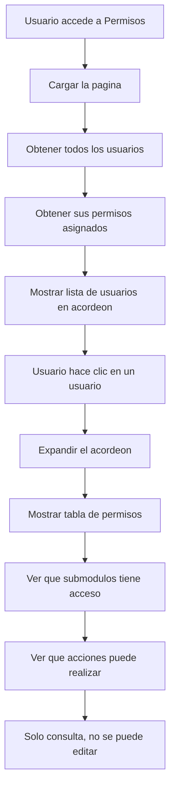
